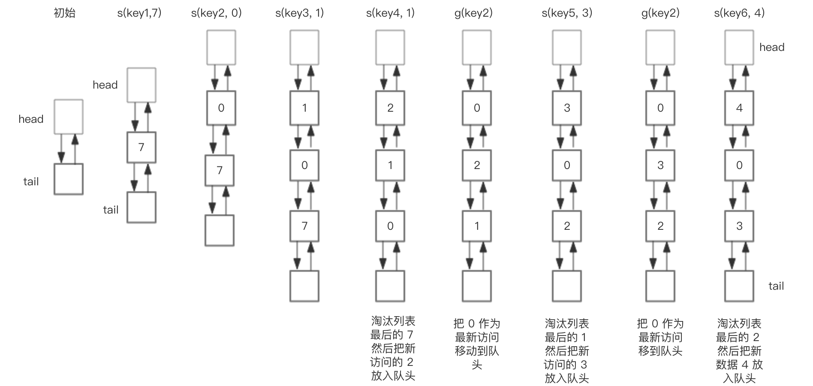
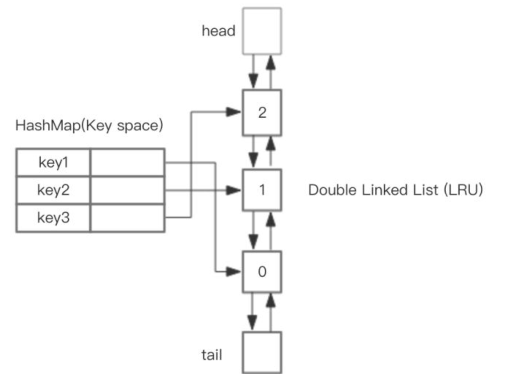
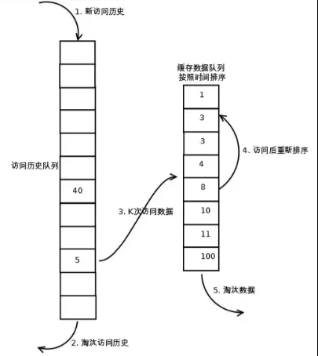
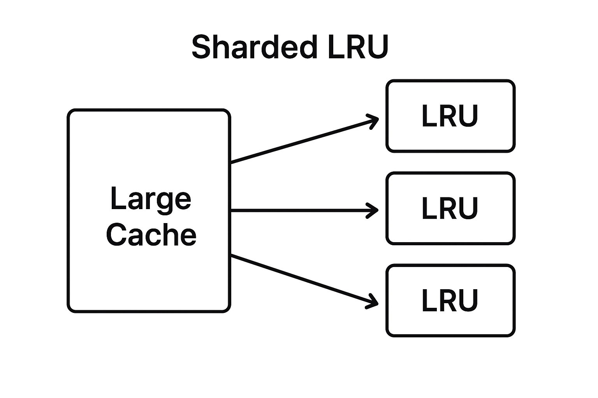

# 缓存系统：

## 1.项目概述

一个基于 C++ 的轻量级缓存库，提供了可扩展的缓存策略实现。核心特性包括：

\- **模板化设计**：支持任意类型的键（Key）和值（Value）	【泛型设计】

\- **多策略支持**：提供 LRU、LRU-K 等缓存替换算法

\- **线程安全**：内置互斥锁保护共享数据

\- **数据源支持**：使用SQLite模拟底层磁盘数据，模拟操作系统真实取页流程

## 2.项目结构

## 3.项目实现-LRU

### 1.底层数据源：

使用文件式轻量级关系型数据库：SQLite3 真实模拟操作系统取址流程（SQLite下载网址：[SQLite Download Page](https://www.sqlite.org/download.html)）

使用.dll和.a文件动态链接库

这里对于数据库中的数据，默认所有的数据都是字符串varchar类型，在获取字符串类型后自行转换成缓存中所需要的Key，Value类型。

### 2.LRU原理

LRU算法，即Least Recently Used（最近最少使用页面算法），在需进行置换时将**最近最久未使用**的页面予以淘汰。

使用一个特殊的栈来存储各个页面。当一个进程访问一个新的页面时，如果此页面已经在栈中，则把页面置于栈顶；如果没有，则淘汰掉栈底的页面，把页面压入栈顶。

### 3.LRU及优化算法的实现

#### LRU：

哈希表让每一次查询时间复杂度控制到O(1)，而双向链表可以便捷的实现页面顺序的调换：若存在对应的表结点则**直接找到结点并删去**，再**从头插入页面结点**；若不存在则**使用tail删去尾结点**，并**使用head插入新页结点**。

如图，使用哈希表和双向链表结合的数据结构实现了LRU页面置换算法：

#### LRU-K：

使用继承的方式对LRU算法再次优化，增加阈值K常量定义，在某个页结点访问次数达到K次后再把该页放入缓存中。类中加入一个构造好的LRU缓存对象直接存储所有页结点的历史访问次数。

这里覆写了Value get(Key key)及void put(Key key, Value value)方法，实现了对访问次数的判断后放入。在测试.cpp文件中，通过put的覆写更改了应有的放入逻辑，提高了命中率。

#### LRU-Hash：

直接继承基类Policy，使用持有vector指针数组的方式对LRU缓存进行优化。对key值取哈希并取模，分入不同的LRU缓存片中，使进程能够同时访问不同的片内键值对。在不同进程请求不同的缓存时，可以在对应的片中同时获取对应的值，提升了缓存系统的并发速率。类中引入vector构造对象存放多个分片LRU缓存指针引用，使用hash函数计算每一个键对应的片区，使用vector中的指针对缓存进行访问。

覆写了所有get、put方法。

